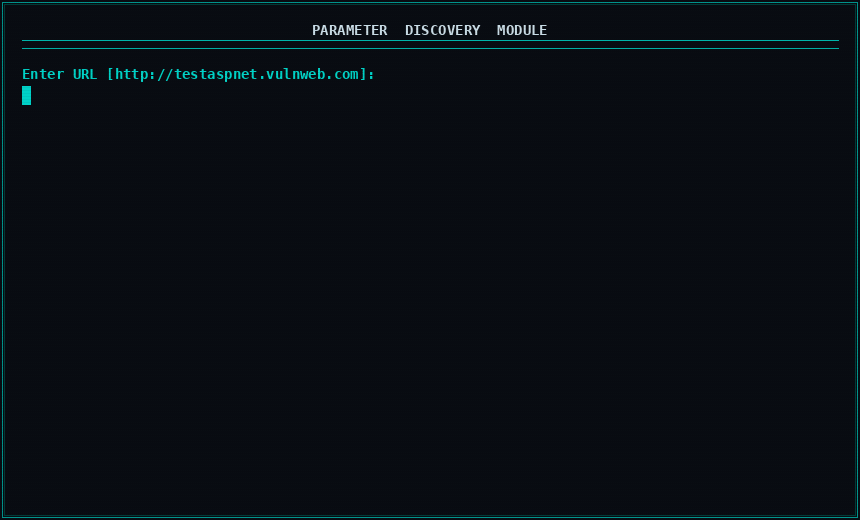

<div align="center">


<br>


</div>

---

## ⚠️ Disclaimer

**HXR is intended strictly for authorized security testing and educational purposes.**

By downloading, installing, or using this tool, you agree to the following:

- You will **only** use HXR on systems you **own** or have **explicit written permission** to test — such as a signed penetration testing agreement, an active bug bounty program scope, a personal lab environment, or a CTF challenge.
- You will **not** use HXR to scan, probe, or attack any system without prior authorization from the owner.
- Unauthorized use of this tool against third-party systems is **illegal** and may violate laws including but not limited to:
  - 🇮🇩 **UU ITE No. 11/2008** (Indonesia)
  - 🇺🇸 **Computer Fraud and Abuse Act (CFAA)** (United States)
  - 🇬🇧 **Computer Misuse Act 1990** (United Kingdom)
  - And equivalent cybercrime laws in your jurisdiction.
- The author **assumes zero liability** for any damage, legal consequences, or misuse resulting from this tool. You are solely responsible for your own actions.

> If you're unsure whether your target is in scope — it's not. Don't do it.

---

## 📖 About

**HXR** is a modular Python-based security reconnaissance framework built to streamline the bug bounty hunting and penetration testing workflow. It combines multiple recon and scanning modules into a single interactive terminal interface — from subdomain enumeration and technology fingerprinting, to parameter crawling, basic vulnerability scanning, and automated report generation.

HXR runs natively on all major platforms — Linux, Windows, macOS, and Termux (Android) — with a clean terminal UI and automatic dependency handling on first launch.

---

## ✨ Features

| Module | Description |
|--------|-------------|
| 🔍 **Target Reconnaissance** | Subdomain enumeration, DNS records, technology fingerprinting |
| 🕷️ **Parameter Discovery** | Web crawler, form extraction, hidden parameter detection |
| 📸 **Screenshot Automation** | Visual documentation via Selenium + HTTP fallback |
| 🛡️ **Vulnerability Scanner** | XSS, Open Redirect, CORS misconfiguration, Git exposure |
| 🔗 **API Endpoint Finder** | JavaScript analysis & API endpoint mining |
| 📄 **Report Generator** | Export scan results to TXT & JSON |
| 🗂️ **Report Archive** | Browse and manage previous scan reports |

---

## 🕷️ Parameter Discovery — Demo

<div align="center">



</div>

---

## 📦 Requirements

Make sure you have the following installed before proceeding:

| Software | Download |
|----------|----------|
| **Python 3.7+** | [python.org/downloads](https://www.python.org/downloads/) |
| **pip** | [pip.pypa.io](https://pip.pypa.io/en/stable/installation/) |
| **Git** | [git-scm.com/downloads](https://git-scm.com/downloads) |
| **Termux** *(Android only)* | [F-Droid](https://f-droid.org/en/packages/com.termux/) |

---

## 🚀 Installation

### 🐧 Linux
```bash
git clone https://github.com/ruyynn/hxr.git
cd hxr
pip install -r requirements.txt
python hxr.py
```

### 📱 Termux (Android)
```bash
pkg update && pkg upgrade -y
pkg install python git -y
git clone https://github.com/ruyynn/hxr.git
cd hxr
pip install -r requirements.txt
python hxr.py
```

### 🪟 Windows
```cmd
git clone https://github.com/ruyynn/hxr.git
cd hxr
pip install -r requirements.txt
python hxr.py
```

### 🍎 macOS
```bash
brew install python git
git clone https://github.com/ruyynn/hxr.git
cd hxr
pip install -r requirements.txt
python hxr.py
```

> 💡 HXR automatically checks and installs any missing dependencies on first run.

---

## 🐛 Report a Bug / Ask a Question

Found a bug, want to request a feature, or just have a question?

| Platform | Contact |
|----------|---------|
| 🐙 **GitHub Issues** | [Open an Issue](https://github.com/ruyynn/hxr/issues) |
| 📧 **Email** | [Click Me](mailto:ruyynn25@gmail.com) |
| 📘 **Facebook** | [Facebook](https://facebook.com) |

---

<div align="center">

If HXR saved you time or helped you land a bounty, a ⭐ goes a long way.<br>
It keeps this project alive and motivates me to build more free tools for the community.

[](https://github.com/ruyynn/hxr)
[](https://github.com/ruyynn)

<br>

*Built by [ruyynn](https://github.com/ruyynn) · For educational & authorized use only*

</div>
